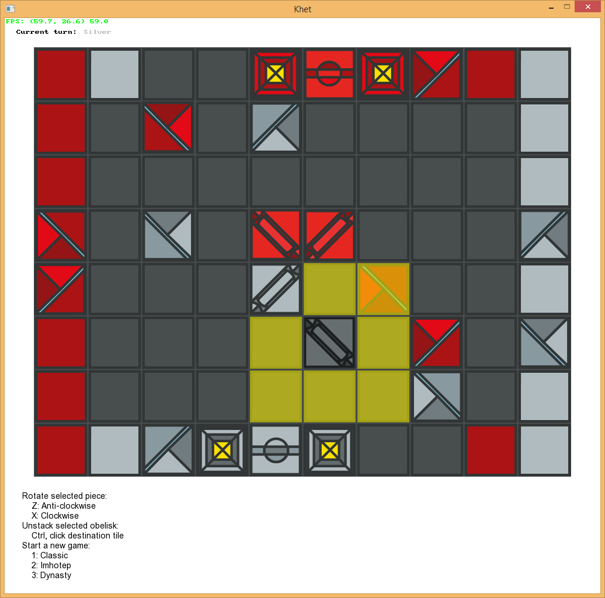

# Khet

I produced this game as my distinction project in the Object-Oriented Programming unit at Swinburne uni in the first semester of 2013. It's an implementation of a [board game called Khet](http://www.khet.com/) (its first version) in C#. Khet is most easily described as being 'laser chess'.

## Gameplay

Below is an example of the board layout:

Khet has four different types of game piece, as shown above, and some of these are equipped with mirrors in order to deflect the lasers. Each player has a laser, originating from next to the red button on their side of the board.

In each turn, a player must move one of their pieces one square in any direction, *or* rotate it 90 degrees. At the end of your turn, you must press your button to fire your laser. If the laser illuminates a piece (of either player!) by hitting a non-mirrored side, that piece is killed, and so removed from the board. The aim of each game is to kill the other player's Pharaoh.

A Djed is a powerful piece that cannot be killed, as it does not possess a non-mirrored side. It also has the ability to use your turn to swap places with an adjacent pyramid or obelisk.
Obelisks are shield pieces and may be stacked or unstacked as your turn. Stacks can be moved as one piece, and when one is hit with the laser, only the top Obelisk is killed.

This overview doesn't quite do it justice; please see the original, comprehensive but succinct, [rule booklet](Khet_Rules_final.pdf).

## Download and play the game

To run the game, it's simply a matter of downloading the latest release, extracting it, then running the executable =)

## Development setup

I developed this game with MonoDevelop on Ubuntu, using Swinburne's [SwinGame SDK](http://www.swingame.com/).

To compile the source code, you'll need:

- Mono / .NET 4
- SwinGame

And for development you'll also need:

- Xamarin Studio (MonoDevelop) / Visual Studio
- NUnit

### Mono and MonoDevelop

For Linux/Mac, you'll need MonoDevelop. On Windows, you can use either Xamarin Studio (MonoDevelop) or Visual Studio.

To build and run C# binaries, Windows will use the .NET framework; Mono does this on Linux and Mac, and should be automatically installed by MonoDevelop as required.

To install MonoDevelop on Linux/Mac/Windows, follow the instructions on the [MonoDevelop website](http://www.monodevelop.com/download/).

### NUnit

On Linux, use your package manager to install the appropriate nunit package, e.g.:

	sudo apt-get install monodevelop-nunit

On Windows, [download and install the MSI package](http://www.nunit.org/index.php?p=download).

If you're running OS X, you're on your own here, I'm afraid =P

Always make sure the unit tests pass before committing to Git.

### SwinGame

Unlike with Windows, SwinGame needs to be installed on Linux. To do this, you need to compile it from source, which [requires some prerequisites to be installed](http://www.swingame.com/wiki/index.php?title=SwinGame_3_Beta#Notes_for_Linux). Use your package manager to install them, e.g.:

	sudo apt-get install fpc libsdl1.2-dev libsdl-gfx1.2-dev libsdl-image1.2-dev libsdl-mixer1.2-dev libsdl-ttf2.0-dev libsdl-net1.2-dev

[Download](http://www.swingame.com/index.php/downloads.html) the Source distribution of SwinGame, and extract it. Navigate a terminal window to the ProjectTemplate directory, and run:

	sudo ./clean.sh; sudo ./build.sh -i

to build and install the SwinGame SDK onto your machine.

I'm not sure whether something similar needs to be done on OS X.

### Running / debugging

Once you have all the prerequisites installed, open `Khet.sln` in your IDE.

At the top of the window, make sure the Solution Configuration is set to the build configuration that matches your platform. Click Start to build and run the game.

## Building from source

If you just want to build the binary from source without setting up an IDE, you'll still need to install the compilation prerequisites mentioned at the top of the Development section.

On Windows, be sure to [add the path to your .NET 4.0 framework installation on your machine to your PATH environment variable](http://stackoverflow.com/a/12608705/1239774).

Open a terminal window and `cd` into the `Khet` directory where `Khet.csproj` is located. On Windows, now run:

    msbuild
    msbuild /target:CopyFiles

On Linux/Mac:

    xbuild && xbuild /target:CopyFiles

If that worked, you should now be able to run the game executable in the `bin` directory.

## Design

Here's my UML diagram for the version I submitted with my portfolio ([also available on Lucidchart](https://www.lucidchart.com/documents/view/41d1-0a0c-516f55df-9abd-01730a0041d5)):

