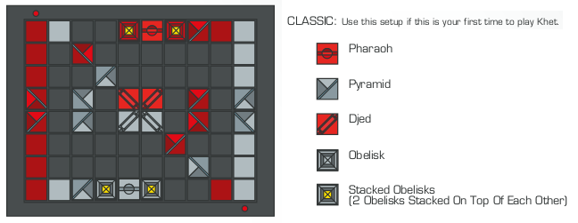
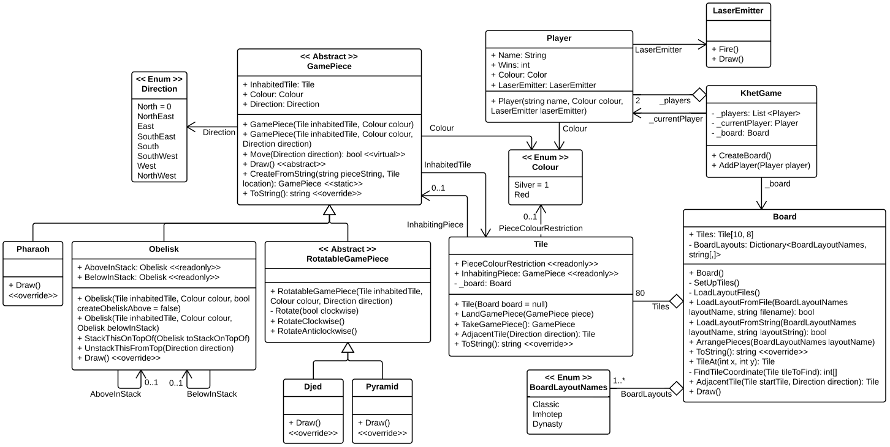

# Khet

I produced this game as my distinction project in Object-Oriented Programming at Swinburne uni in the first semester of 2013. It's an implementation of a [board game called Khet](http://www.khet.com/) (its first version) in C#. Khet is most easily described as being 'laser chess'.

## Gameplay

Below is an example of the board layout:

Khet has four different types of game piece, as shown above, and some of these are equipped with mirrors in order to deflect the lasers. Each player has a laser, originating from next to the red button on their side of the board.

In each turn, a player must move one of their pieces one square in any direction, *or* rotate it 90 degrees. At the end of your turn, you must press your button to fire your laser. If the laser illuminates a piece (of either player!) by hitting a non-mirrored side, that piece is killed, and so removed from the board. The aim of each game is to kill the other player's Pharaoh.

A Djed is a powerful piece that cannot be killed, as it does not possess a non-mirrored side. It also has the ability to use your turn to swap places with an adjacent pyramid or obelisk.
Obelisks are shield pieces and may be stacked or unstacked as your turn. Stacks can be moved as one piece, and when one is hit with the laser, only the top Obelisk is killed.

This overview doesn't quite do it justice; please see the original, comprehensive but succinct, [rule booklet](Khet_Rules_final.pdf).

## Game installation

TODO

## Development setup

I developed this game with MonoDevelop on Ubuntu, using Swinburne's [SwinGame SDK](http://www.swingame.com/).

To compile the source code, you'll need:

- Mono
- MonoDevelop
- SwinGame

### Mono and MonoDevelop

For Linux/Mac, you'll need MonoDevelop. On Windows, you could use MonoDevelop, but it should still work in Visual Studio (though this is untested).

To install both Mono and MonoDevelop, follow the instructions on the [MonoDevelop website](http://www.monodevelop.com/download/).

### SwinGame

On Linux, SwinGame needs to be installed. To do this, you need to compile it from source, which [requires some prerequisites to be installed](http://www.swingame.com/wiki/index.php?title=SwinGame_3_Beta#Notes_for_Linux). Use your package manager to install them, e.g.:

	sudo apt-get install fpc libsdl1.2-dev libsdl-gfx1.2-dev libsdl-image1.2-dev libsdl-mixer1.2-dev libsdl-ttf2.0-dev libsdl-net1.2-dev

[Download](http://www.swingame.com/index.php/downloads.html) the Source distribution of SwinGame, and extract it. Navigate a terminal window to the ProjectTemplate directory, and run:

	sudo ./clean.sh; sudo ./build.sh -i

to build and install the SwinGame SDK onto your machine.

## Design

Here's my UML diagram for the final submitted version ([also available on Lucidchart](https://www.lucidchart.com/documents/view/41d1-0a0c-516f55df-9abd-01730a0041d5)):

